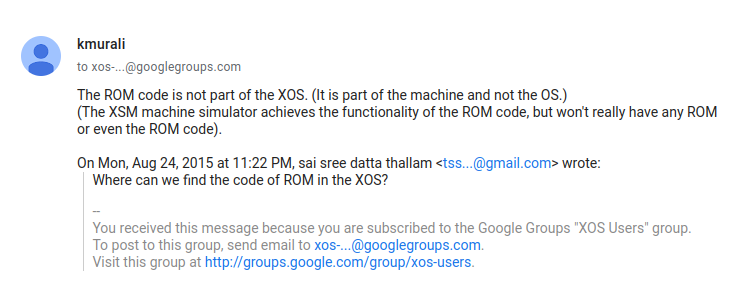

# eXpOSNITC

OS Lab - National Institute of Technology, Calicut

## Stages

 - [x] Stage 1: Download
 - [x] Stage 2: File system inro
 - [x] Stage 3: Bootstrap
 - [x] Stage 4: SPL language intro
 - [x] Stage 5: Used the debugger
 - [x] Stage 6: Pagin and user mode execution
 - [x] Stage 7: User program with ABI header
 - [x] Stage 8: Timer interrupt sample code
 - [x] Stage 9: Kernal Stack
 - [x] Stage 10: Write system call sample
 - [x] Stage 11: Intro to ExpL - writing my own library for write system call. This was a fun one. Tip: If you dont get something sleep over it.
 - [x] Stage 12: Made a small scheduler using timer interrupt
 - [x] Stage 13: Boot module and round robin a bit
 - [x] Stage 14: int 10 and scheduler module
 - [x] Stage 15: Terminal acqire and relase.
 - [x] Stage 16: Terminal read
 - [x] Stage 17: SHELL Mark 1 (wowowowowowo!!!)
 - [x] Stage 18: load instruction: with disk interrupt
 - [x] Stage 19: Exception handler: a lot of debug time for me
 - [x] Stage 20: Fork sys call: it was nice had to debug a lot due to a stupid careless mistage in int 10 code
 - [x] Stage 21: Wait, signal, get pid, get ppid - a lot of debug time man. silly ass error.
 - [x] Stage 22: Semaphores - Bug less code is uploaded
 - [ ] Stage 23
 - [ ] Stage 24
 - [ ] Stage 25
 - [ ] Stage 26
 - [ ] Stage 27
 - [ ] Stage 28

# Doubts and points
<ol>
	<li>
		<!-- 1 -->
		

		
Is Kernal mode same as Previlaged mode and User mode - Unprevilaged mode?

		
Yes, its just terminology

		

	</li>
	<li>
		<!-- 2 -->
		

		
Who copies Boot ROM to the 0th location of Memory? Memory is volatile so someone should do it.

		
 answer was discussed in the xos google group. 
		<a href="https://groups.google.com/g/xos-users/c/cnQkHeGSafY/m/ebEFi2PmAgAJ"> grp discussion </a>
		 
		
		

		

	</li>
	<li>
		<!-- 3 -->
		

		
In stage 3 for print statement only 13 characters got printed. Why?

		
This is an abstraction that is hidden from us.

		

	</li>
	<li>
		<!-- 4 -->
		

		
What is the size of one char here? (most probably 8)

		
The following is only my guess. ask profressior for conformation. The xsm machine's word length is 13characters. Reason for believing the last statement is - when we try to print some big string stored in a general purpose register the string gets truncated after 13 chars. Then now in the xfs-disk the word size is 16 characters This can be seen in stage 2: understanding Filsystem, when we dump the data stored inside a file.

		

	</li>
	<li>
		<!-- 5 -->
		

		
In stage 1: its written one word is 16 characters long. But in stage 3 one string can only hold 13 characters. Why?

		
Both values are 16 only. But when we implement them we have to use \n and \0 and other stuff to handle string that's why size of stirng appears to be 13 when we execute code

		

	</li>
	<li>
		<!-- 6 -->
		

		
MOV [1500], R0 in unprevilaged mode will set dirty bit to 1, since  the mem location is modified. But will the reference bit be made to 1. aka Is modification a subset of referencing?

		
yes, (i think)

		

	</li>
	<li>
		<!-- 7 -->
		

		

		When we are in the middle of a user program. And when an interrupt gets hit.
		The IP value will be pushed into the stack, then SP++.
		IP will be changed to the destination where the interrupt code is present.
		 
		So when we are in the interrupt's code. The SP will be storing the logical address value that we already kept.
		Does this mean that we can't use the stack while writing the interrupt code? Right?
		

		
yes, (i think)
		 
		or else we will have to store SP value in some register and then make the value the old one before doing ireturn.
		 
		Kernel maintains a new thing called kernal stack - stage 9 stuff
		

		

	</li>
	<li>
		<!-- 8 -->
		

		
 What is the use of Base pointer (BP) ? 

		
Base pointer is used for storing the retur addres when we call a function from another function. Not completely conviced with this. Do more research.

		

	</li>
	<li>
		<!-- 9 -->
		

		
In stage 9 while modifying the timer interrup code. I was not able to use R16 to R19 registes.
		But in theory in Kernal moe R16 to R19 should be available. Why was I not able to use them?

		
R16 to R19 are reserved for compiler to convert code form spl to assembly.<a href="https://exposnitc.github.io/support_tools-files/spl.html">go to registers and ports in the doccumentation</a>

		

	</li>
	<li>
		<!-- 10 -->
		

		
Will the valuse inside xsm disk be saved even after my unix system is rebooted.

		
Yes, I just checked what are the contents of my disk using the copy xfs-interface command. And my old code is still in it (The ones that I loaded in my last coding session).

		

	</li>
	<li>
		<!-- 11 -->
		

		
When we execute library code will the register values be disturbed?

		
Yes, If you need proof go and read the library.lib file inside myexpos/expl/ directory

		

	</li>
	<li>
		<!-- 12 -->
		

		
In stage 13 we are asked to initialise the user page number of IDLE process as 82. But in stage 12 we initialised it to page number 81. Is there any particular reason to do that?

		
read properly it was already 82 only. You messed up Stack page number with user area page number

		

	</li>
	<li>
		<!-- 13 -->
		

		
Caution while using spl alias command

		
 Alias is not a variable so if you modify the registers directly (for example: after restore instruction) dont use the alias name because the values would have been overrided. 

		

	</li>
	<li>
		<!-- 14 -->
		

		
Is busy looping same as polling technique?

		
Polling is when a process polls for lets say some data and does something in the mean time. While In busy loop the program just waits without doing anything in between checks.

		

	</li>
	<li>
		<!-- 15 -->
		

		
When we use the exposcall() to call a syscall (lets say int7 is called). In int7 code we change the values of registers. So before the call is made will expl compiler save all reg values into the stack?

		
My guess: the expl compiler will handle it.

		

	</li>
	<li>
		<!-- 16 -->
		

		
Why is there a difference in interrupt number and system call number? like what is the use of keeping it differen?

		
My guess: we implement differnt syscalls in one interrupt's code sooooo we need different numberings. My guess was correct.

		

	</li>
	<li>
		<!-- 17 -->
		

		
To chaeck if a file is following xexe structure should we check the name of the file to contain .xexe?

		
There will be a inode table entry which tells that data

		

	</li>
	<li>
		<!-- 18 -->
		

		
Dot memorize function numbers - go check <a href="https://exposnitc.github.io/support_tools-files/constants.html">SPL constants</a>

		
Just a pointer that i found very late

		

	</li>
	<li>
		<!-- 19 -->
		

		
Should we copy in the inode table from disk to memory or will it be handled internally?

		
We have to copy it manually. But idk where its mentioned in the stage 17 doc. My bad its there in Modifications to Boot Module point 1.

		

	</li>
	<li>
		<!-- 20 -->
		

		
For exception handler and int10 instead of using basic halt statement. do a pring statemnt also so it will be easy to debug in initial stages.

		
Bonus points :)

		

	</li>
	<li>
		<!-- 21 -->
		

		
This is a point related to Point 5: Why are strings size 13 in xos ... I just saw A nice message in the xos google group. Just check it out <a href=https://groups.google.com/g/xos-users/c/BCbwiQIhTSE/m/-wtEKYMMCQAJ>here</a>

		
Bonus points :)

		

	</li>
	<li>
		<!-- 22 -->
		

		
In Disk map table discritpiton is a bit wrong

		
ask sir

		

	</li>
	<li>
		<!-- 23 -->
		

		
How to check if the page table entry is valid or not - in spl we cant reference a single character

		
ask sir

		

	</li>
</ol>
